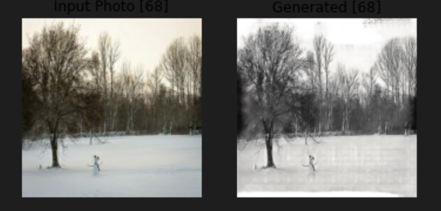

# Image-2-Sketch
Cycle Gan is used to convert Images to Sketch  
# Model 
<table>
  <tr>
    <td>
  Generator 
  
    <td/>
    <td>
  Discriminator 
  
    <td/>
  </tr>
</table>

# Result
<table>
<tr>
<td></td>
<td> </td>
<td> </td>
</tr>
<tr>
<td></td>
<td> </td>
<td></td>
</tr>
<tr>
<td></td>
<td> </td>
</tr>

</table>
